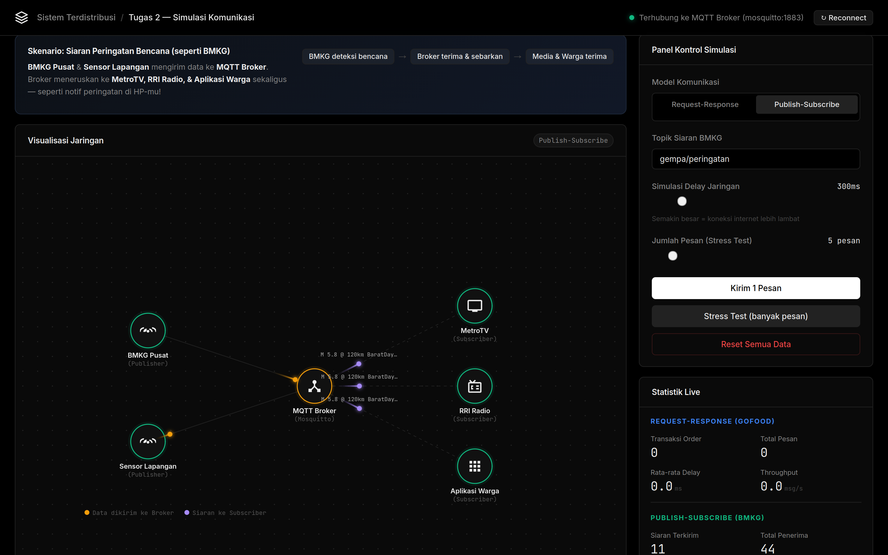
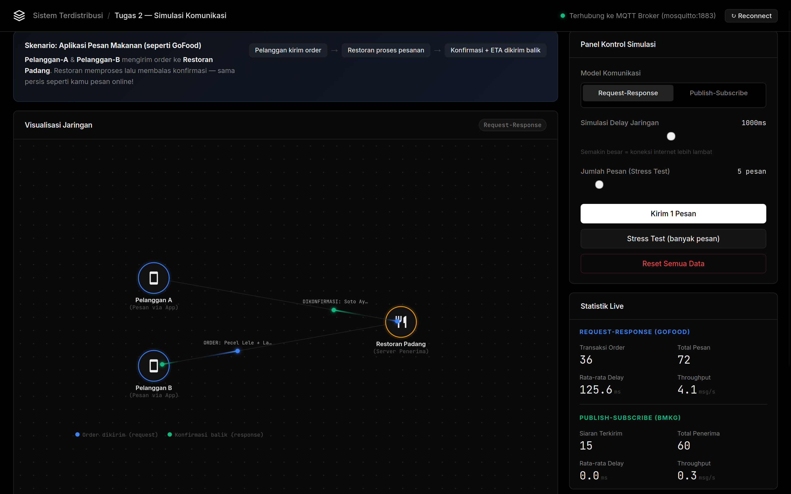

<div align="center">

# Distributed System Communication Simulator

**Simulasi interaktif berbasis web untuk membandingkan dua model komunikasi sistem terdistribusi secara real-time.**


[Demo Lokal](#-getting-started) · [Cara Penggunaan](#-penggunaan) · [Arsitektur](#-arsitektur) · [Model Komunikasi](#-model-komunikasi)

</div>

---

## Tentang Proyek

Proyek ini mensimulasikan bagaimana node-node dalam **sistem terdistribusi** saling berkomunikasi menggunakan dua model yang berbeda: **Request-Response** dan **Publish-Subscribe**.

Yang membedakan proyek ini dari simulasi biasa — pesan yang bergerak di canvas *bukan animasi palsu*. Setiap partikel merepresentasikan paket MQTT yang benar-benar dikirim dan diterima oleh broker **Eclipse Mosquitto** yang berjalan di Docker. Latensi yang ditampilkan adalah latensi nyata dari round-trip jaringan.

Dua skenario dunia nyata digunakan sebagai konteks:

| Model | Skenario | Analogi |
|-------|----------|---------|
| **Request-Response** | Pemesanan makanan online | Pelanggan order → Restoran konfirmasi |
| **Publish-Subscribe** | Siaran peringatan bencana | BMKG publish → MetroTV, RRI, Warga terima serentak |

### Dibangun Dengan

| Layer | Teknologi |
|-------|-----------|
| Backend | Python 3.12, FastAPI, Uvicorn |
| Messaging | Paho MQTT, Eclipse Mosquitto 2 |
| Real-time | WebSocket (native FastAPI) |
| Frontend | Vanilla HTML5, CSS3, Canvas API |
| Container | Docker, Docker Compose |

---

## Fitur

- **Visualisasi topologi jaringan** dengan animasi partikel real-time di HTML5 Canvas
- **MQTT nyata** — bukan mock/simulasi data, menggunakan broker Mosquitto aktif
- **Animasi berwarna** membedakan jenis pesan: biru (request), hijau (response), kuning (publish), ungu (broadcast)
- **Live metrics** — latency, throughput, dan jumlah transaksi keduanya ditampilkan bersamaan
- **Delay jaringan yang dapat diatur** (50ms–2000ms) untuk mensimulasikan kondisi jaringan berbeda
- **Stress test** — kirim N pesan berturut-turut untuk mengamati performa sistem di bawah beban
- **Label payload** tampil di atas partikel — bisa dibaca isi pesannya saat bergerak
- **Canvas HD** — rendering sharp di layar retina/HiDPI

---

## Tampilan Aplikasi

### Mode Request-Response — Simulasi Aplikasi Pesan Makanan (GoFood)



Pada mode ini, dua node **Pelanggan** (Pelanggan A & B) mengirim order ke **Restoran Padang** (server). Setiap order membawa payload berisi nama menu, dan server merespons dengan konfirmasi + estimasi waktu. Partikel **biru** merepresentasikan request yang dikirim, partikel **hijau** merepresentasikan response yang dikembalikan. Komunikasi bersifat sinkron — pelanggan menunggu konfirmasi sebelum order berikutnya dikirim.

---

### Mode Publish-Subscribe — Simulasi Siaran Peringatan Bencana (BMKG)



Pada mode ini, **BMKG Pusat** dan **Sensor Lapangan** bertindak sebagai publisher yang menerbitkan data ke MQTT Broker (Mosquitto). Broker meneruskan siaran secara serentak ke tiga subscriber: **MetroTV**, **RRI Radio**, dan **Aplikasi Warga**. Partikel **kuning** menunjukkan data yang dikirim ke broker, partikel **ungu** menunjukkan siaran ke masing-masing subscriber. Komunikasi bersifat asinkron — publisher tidak perlu menunggu konfirmasi penerima.

---

## Getting Started

### Prasyarat

Pastikan sudah terinstal:

- [Docker](https://docs.docker.com/get-docker/) `>= 20.10`
- [Docker Compose](https://docs.docker.com/compose/install/) `>= 2.0`

Tidak perlu Python terpasang di mesin host — semuanya berjalan di dalam container.

### Instalasi & Menjalankan

```bash
# 1. Masuk ke direktori proyek
cd Tugas2

# 2. Build dan jalankan semua service
docker compose up --build -d
```

```bash
# 3. Buka browser
http://localhost
```

Selesai. Indikator hijau di kanan atas berarti broker MQTT terhubung dan siap.

### Menghentikan

```bash
docker compose down
```

### Melihat Log

```bash
# Semua service
docker compose logs -f

# Hanya aplikasi web
docker compose logs -f webapp
```

> **Catatan:** Jika port 80 sudah dipakai, ubah `"80:8000"` menjadi `"8080:8000"` di `docker-compose.yml`, lalu akses `http://localhost:8080`.

---

## Arsitektur

```
Browser
  │  (HTML5 Canvas + WebSocket client)
  │
  │  ws://localhost/ws
  ▼
FastAPI + Uvicorn  (port 80 → 8000)
  │  SimulationManager
  │  ├── RRServer    (MQTT subscriber pada rr/request)
  │  ├── RRClient x2 (MQTT publisher + subscriber per client)
  │  ├── Publisher x2 (MQTT publisher pada ps/*)
  │  └── Subscriber x3 (MQTT subscriber pada ps/*)
  │
  │  paho-mqtt
  ▼
Eclipse Mosquitto v2  (port 1883, internal Docker network)
```

Semua service berkomunikasi lewat Docker network `simnet`, menggunakan nama container sebagai hostname — tidak ada hardcoded IP.

---

## Model Komunikasi

### Request-Response

Pola komunikasi **sinkron** — pengirim menunggu balasan sebelum lanjut.

```
pelanggan-A ──[ ORDER: Ayam Geprek x2 ]──► restoran-padang
            ◄──[ DIKONFIRMASI | ETA: 20 menit ]──
```

**Implementasi:** RPC-over-MQTT menggunakan `correlation_id`. Setiap request membawa ID unik, server menerbitkan respons ke topik `rr/response/{sender_id}`. Client memblokir dengan `threading.Event` hingga respons tiba (timeout 10 detik).

**Karakteristik:**
- 1 transaksi = 2 pesan (request + response)
- Latency diukur dari kirim hingga terima balasan
- Bottleneck jika server lambat memproses

---

### Publish-Subscribe

Pola komunikasi **asinkron** — publisher tidak tahu dan tidak peduli siapa yang menerima.

```
bmkg-pusat ──[ M 6.2 @ Kalimantan Timur ]──► Mosquitto Broker
                                                  ├──► MetroTV
                                                  ├──► RRI-Radio
                                                  └──► AplikasiWarga
```

**Implementasi:** Native MQTT. Publisher menerbitkan ke `ps/gempa/peringatan` atau `ps/cuaca/ekstrem`. Broker mendistribusikan ke semua subscriber yang aktif secara bersamaan.

**Karakteristik:**
- 1 publikasi = N pesan broadcast (N = jumlah subscriber aktif)
- Asinkron — publisher tidak menunggu
- Subscriber bisa join/leave kapan saja tanpa mengganggu publisher

---

## Penggunaan

### Antarmuka

```
┌────────────────────────────────────┬──────────────────────┐
│  Banner Skenario                   │  Panel Kontrol       │
├────────────────────────────────────│  - Pilih model       │
│                                    │  - Atur delay        │
│     Canvas Topologi Jaringan       │  - Jumlah pesan      │
│     (animasi partikel real-time)   │  - Tombol aksi       │
│                                    ├──────────────────────│
├────────────────────────────────────│  Statistik Live      │
│  Log Pesan Real-time               │  - RR metrics        │
│  (timestamp + isi pesan)           │  - PS metrics        │
└────────────────────────────────────│  Perbandingan Model  │
                                     └──────────────────────┘
```

### Alur Eksperimen yang Disarankan

**1. Uji Request-Response dasar**
- Pilih model **Request-Response**
- Klik **"Kirim 1 Pesan"** → amati 2 partikel (biru lalu hijau)
- Baca log: lihat isi ORDER dan konfirmasi DIKONFIRMASI

**2. Uji Publish-Subscribe dasar**
- Pilih model **Publish-Subscribe**
- Klik **"Kirim 1 Pesan"** → amati 1 partikel kuning ke broker, lalu 3 partikel ungu ke semua subscriber sekaligus
- Pilih topik yang berbeda (gempa / cuaca) dan amati perubahan payload

**3. Eksperimen delay jaringan**
- Atur slider ke 50ms → kirim beberapa pesan, catat latency
- Atur slider ke 1500ms → kirim pesan yang sama, bandingkan latency
- Amati perbedaan RR vs PS dalam merespons delay tinggi

**4. Stress test & perbandingan metrik**
- Set jumlah pesan ke 20, klik **"Stress Test"** pada mode RR
- Catat throughput dan avg latency
- **Reset**, lakukan hal sama pada mode PS
- Bandingkan hasil di panel **Statistik Live**

---

## Membaca Metrik

| Metrik | Keterangan |
|--------|------------|
| `Transaksi / Siaran` | Jumlah siklus komunikasi sukses |
| `Total Pesan` | Total paket yang berpindah (semua arah). RR: ×2, PS: ×N subscriber |
| `Rata-rata Delay` | Round-trip time rata-rata dalam milidetik |
| `Throughput` | Kecepatan sistem (pesan/detik), dihitung dari rentang waktu aktif |

> **Heads up:** Throughput PS akan selalu terlihat lebih tinggi dari RR pada transaksi yang sama karena 1 publish menghasilkan 3 broadcast. Ini bukan berarti PS lebih "cepat" — keduanya memang dirancang untuk kebutuhan yang berbeda.

---

## Struktur Proyek

```
Tugas2/
├── backend/
│   ├── main.py           # FastAPI app — WebSocket, HTTP routing, broadcast
│   └── simulation.py     # Core: RRServer, RRClient, Publisher, Subscriber, SimulationManager
├── frontend/
│   ├── index.html        # Markup halaman
│   ├── script.js         # Canvas, WebSocket client, animasi partikel
│   └── style.css         # Dark theme, layout, komponen UI
├── Dockerfile            # Build image Python + Uvicorn
├── docker-compose.yml    # Orkestrasi webapp + mosquitto
├── mosquitto.conf        # Konfigurasi broker MQTT
└── requirements.txt      # paho-mqtt, fastapi, uvicorn, websockets
```

<details>
<summary><strong>Detail Dependensi Python</strong></summary>

```
paho-mqtt>=1.6.1   # MQTT client library, kompatibel v1 dan v2
fastapi            # Web framework + WebSocket support
uvicorn            # ASGI server
websockets         # WebSocket protocol support
```

</details>

<details>
<summary><strong>Topik MQTT yang Digunakan</strong></summary>

| Topik | Digunakan Oleh | Keterangan |
|-------|---------------|------------|
| `rr/request` | RRClient → RRServer | Semua order masuk ke sini |
| `rr/response/{node_id}` | RRServer → RRClient | Respons spesifik per client |
| `ps/gempa/peringatan` | Publisher → Broker → Subscriber | Data gempa bumi |
| `ps/cuaca/ekstrem` | Publisher → Broker → Subscriber | Peringatan cuaca ekstrem |

</details>

---

## Perbandingan Model Komunikasi

| Aspek | Request-Response | Publish-Subscribe |
|-------|:---:|:---:|
| Sifat | Sinkron | Asinkron |
| Pola | 1-to-1 | 1-to-N |
| Menunggu balasan | Ya | Tidak |
| Coupling pengirim & penerima | Ketat | Longgar |
| Overhead per transaksi | Rendah (2 msg) | Lebih tinggi (N+1 msg) |
| Contoh nyata | HTTP, REST API, gRPC | MQTT, Kafka, RabbitMQ |
| Use case | Login, pembayaran, query data | Notifikasi, IoT sensor, live feed |

---

## Referensi

- Coulouris et al. — *Distributed Systems: Concepts and Design*, 5th ed. (2012)
- Tanenbaum & Van Steen — *Distributed Systems: Principles and Paradigms*, 3rd ed. (2017)
- Eugster et al. — [The Many Faces of Publish/Subscribe](https://dl.acm.org/doi/10.1145/857076.857078), ACM Computing Surveys (2003)
- [MQTT v5.0 Specification](https://docs.oasis-open.org/mqtt/mqtt/v5.0/mqtt-v5.0.html) — OASIS Standard (2019)
- [Eclipse Mosquitto Documentation](https://mosquitto.org/documentation/)
- [FastAPI WebSocket Guide](https://fastapi.tiangolo.com/advanced/websockets/)
- [HiveMQ — MQTT Essentials](https://www.hivemq.com/mqtt-essentials/)

---

<div align="center">

Dibuat untuk Tugas 2 — Mata Kuliah Sistem Terdistribusi

</div>
